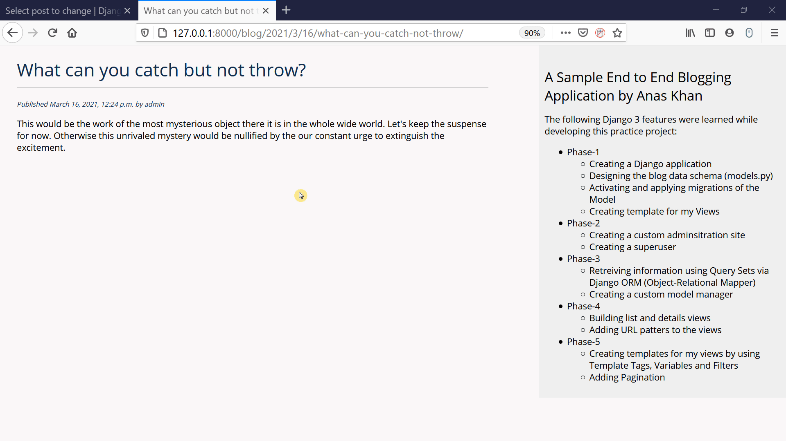
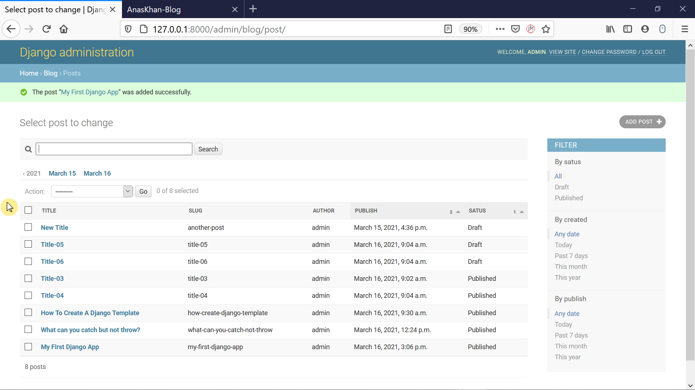

# Django-BloggingWithAdmin
The end to end service created with predefined Entity-Relationship Diagram to allow users and admin to control the blogging service.

This service has two prominant parts: 
1) Admin Pages 
2) Frontend Pages.

## The Frontend Pages includes:

  

1. Here we have the HomePage using the custom manager to show all the posts.

2. The user can read each post in detail after clicking on it.

3. We have paginated the HomePage with 4 items in each page.
## The Modified Admin Page includes:
Here the admin can monitor all the posts.

  

Here the admin can make the add or update a particular post.

  

1. The right sidebar that allows to filter results by the fields included in the respective attribute.
2. A search bar has been added using the respective attributes.
3. Navigation Links has been added to allow the admin to navigate through a date hierarchy.

