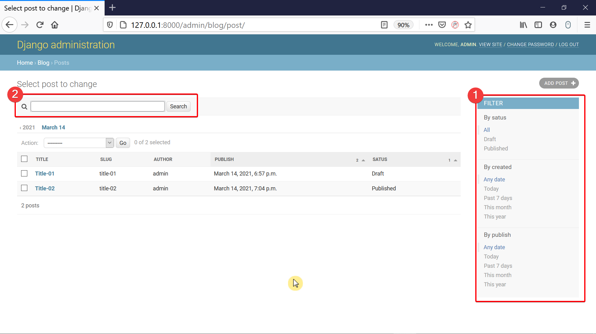

# Django-BloggingWithAdmin
The end to end service created with predefined Entity-Relationship Diagram to allow users and admin to control the blog from a website.

  

## The Modified Admin Page includes:

1. The right sidebar that allows to filter results by the fields included in the respective attribute.
2. A search bar has been added using the respective attributes.
3. Navigation Links has been added to allow the admin to navigate through a date hierarchy.
